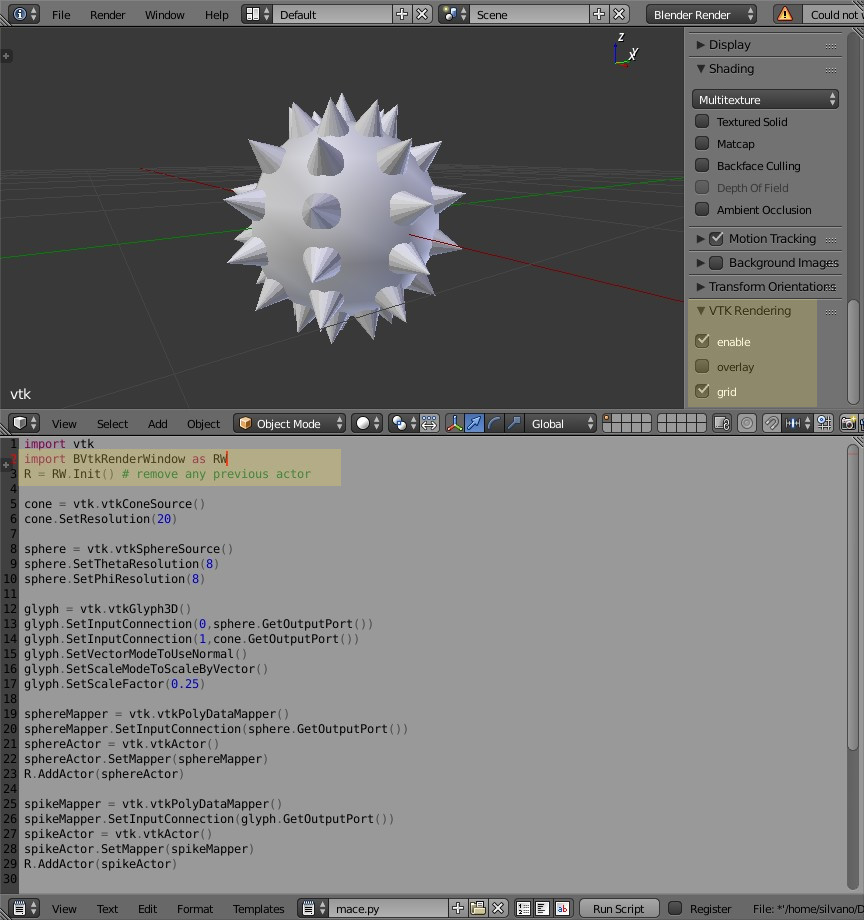

# BVtkRenderWindow
small blender addon that allow VTK to draw on a Blender 3DView.

**addon for**: [Blender](http://blender.org) version *2.79*.  
**current version**: 1.0   
**license**: [GPL3](http://www.gnu.org/licenses/quick-guide-gplv3.html)   

### Prerequisites: 
__VTK (version 7 and above) and VTK python wrappers compatible with the python used in Blender.__   
For Ubuntu 16.04 and above you may try the following binaries [BVtkBinaries.zip]( https://drive.google.com/file/d/1-t7bhygXidgwJE0Y_WLV9q0Tw198_XUe )(147MB).         
To build VTK your own please look here: [build_vtk_for_blender]( https://github.com/simboden/BVtkNodes/blob/master/build_vtk.md ).     

### Goals:
- code your vtk-python script using the Blender console or text editor
- use the blender 3dview as a vtkRenderWindow
- control the camera in the Blender way

